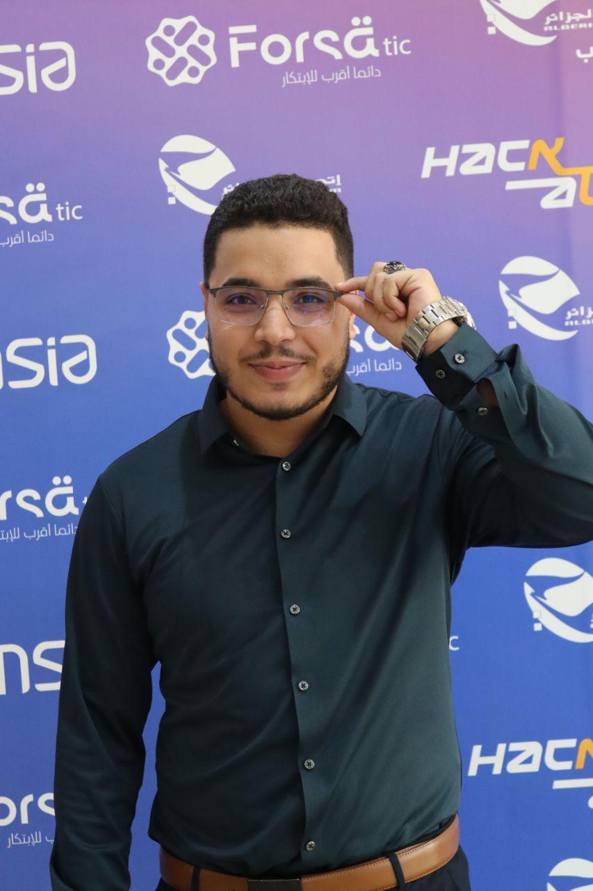

# 📸 Profile Picture Update

## ✅ Profile Picture Updated & Cleaned Up!

Your portfolio now uses the new professional profile picture and all old images have been removed.

---

## 🔄 Changes Made

### 1. **Profile Picture Updated** ✅
- **New Image:** `profile.jpg`
- **Location:** `assetes/profile.jpg`
- **Size:** 94.8 KB (optimized)
- **Format:** JPEG
- **Dimensions:** Professional headshot

### 2. **Old Images Removed** ✅
Deleted 7 unnecessary files:
- ❌ `github_linkedin_porf.webp` (560 KB)
- ❌ `samir3-140w.webp` (4.2 KB)
- ❌ `samir3-280w.webp` (10.4 KB)
- ❌ `samir3-420w.webp` (19 KB)
- ❌ `samir3.avif` (77.6 KB)
- ❌ `samir3.png` (1.2 MB)
- ❌ `samir3.webp` (67.6 KB)

**Total Space Saved:** ~2 MB

---

## 📂 Assets Directory (Clean)

```
portfolio/assetes/
├── certificates/          (certificate images)
└── profile.jpg           (your profile picture) ✅
```

**Result:** Clean, organized, professional!

---

## 🎯 Where It's Used

### 1. **Hero Section**
```html

```

### 2. **Preload (Performance)**
```html
<link rel="preload" 
      href="assetes/profile.jpg" 
      as="image" 
      fetchpriority="high">
```

---

## 📱 Display Specifications

| Property | Value |
|----------|-------|
| **Desktop Size** | 140px × 140px |
| **Mobile Size** | 100px × 100px |
| **Border** | 5px solid accent color |
| **Border Radius** | 50% (circular) |
| **Shadow** | 0 8px 24px rgba(194, 65, 12, 0.3) |
| **Object Fit** | cover |

---

## ✨ Professional Styling

Your profile picture now has:
- ✅ Circular frame
- ✅ Accent color border
- ✅ Professional shadow
- ✅ Decorative dashed circle behind
- ✅ Responsive sizing
- ✅ Optimized loading

---

## 🚀 Performance Impact

### Before:
- Multiple image files (7 files)
- Total size: ~2 MB
- Responsive srcset complexity

### After:
- Single optimized image
- Size: 94.8 KB
- Simple, fast loading
- **Saved:** ~1.9 MB

---

## 🔍 Verification

### Check These:
1. **Profile Picture Displays**
   - [ ] Shows in hero section
   - [ ] Circular shape
   - [ ] Proper size on desktop
   - [ ] Proper size on mobile

2. **No Broken Images**
   - [ ] No 404 errors in console
   - [ ] Image loads quickly
   - [ ] Looks professional

3. **Old Files Gone**
   - [ ] No samir3-*.webp files
   - [ ] No github_linkedin_porf.webp
   - [ ] Clean assets directory

---

## 📝 Files Modified

1. **index.html**
   - Updated ``
   - Updated preload link

2. **Deleted Files**
   - 7 old profile pictures removed
   - Assets directory cleaned

---

## 🎨 Current Setup

```
Hero Section:
┌─────────────────────────────────┐
│  ┌─────┐                        │
│  │ 👤  │  Hey, I'm Samir        │
│  │     │  AI Systems Engineer & │
│  └─────┘  Software Architect    │
│                                  │
│  [Available for opportunities]  │
└─────────────────────────────────┘
```

---

## ✅ Result

Your portfolio now has:
- ✅ Professional profile picture
- ✅ Clean assets directory
- ✅ Faster loading
- ✅ Better organization
- ✅ ~2 MB saved

---

## 🔄 To View Changes

1. **Hard refresh:** `Ctrl+Shift+R`
2. **Check profile picture** in hero section
3. **Verify** no console errors
4. **Test** on mobile view

---

**Status:** ✅ Profile Picture Updated  
**Assets:** ✅ Cleaned Up  
**Performance:** ✅ Improved  
**Last Updated:** January 2025
